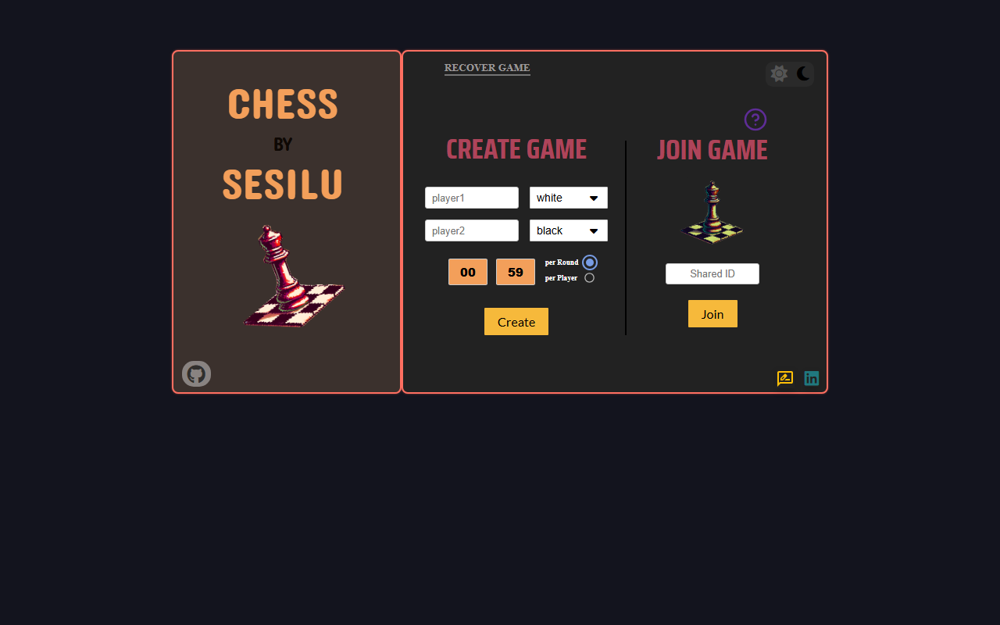
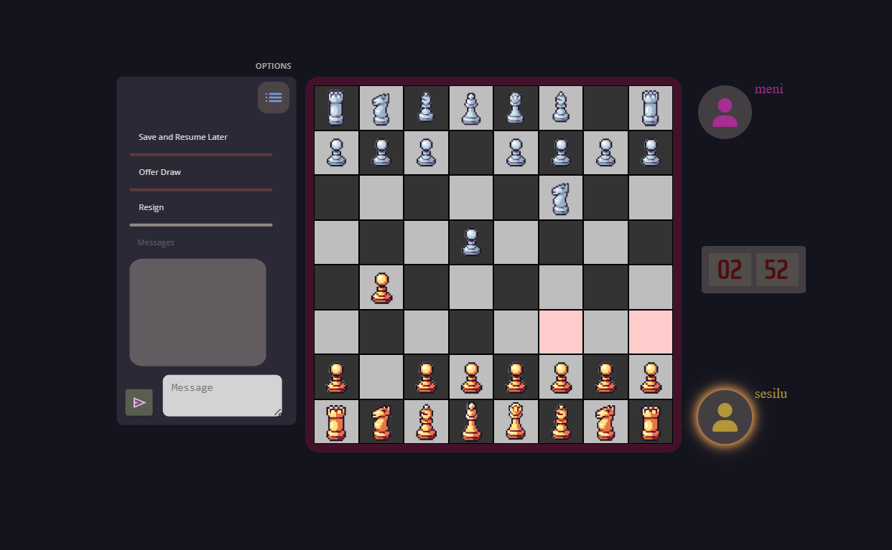

<p float="left">
  
  
</p>

# ♟️ ChessBySesilu

Real-time online chess, built from scratch without frameworks. Create a private match, share the code with a friend and play.

**Live:** [chessbysesilu.com](https://www.chessbysesilu.com)

## How it fits together

```
browser (vanilla JS client)  ⇄  wss://chessbysesilu.com/ws/  ⇄  Nginx  ⇄  Node.js WebSocket server  ⇄  MySQL / MongoDB
```

| Folder | What's inside |
|---|---|
| [`client/`](client) | Vanilla HTML/CSS/JS client: board, game logic, sounds and piece artwork |
| [`server/`](server) | Node.js WebSocket server (`ws`): lobby and match codes, real-time move relay, draws/resign, saving games |

Self-hosted on **AWS EC2** behind an **Nginx** reverse proxy with TLS.

## Tech stack

- **Client:** HTML, CSS, vanilla JavaScript
- **Server:** Node.js, `ws`, `mysql2`, `mongodb`, `dotenv`
- **Data:** MySQL (Amazon RDS), MongoDB
- **Infra:** AWS EC2, Nginx

## Running the server locally

```bash
cd server
npm install ws mysql2 mongodb dotenv
cp .env.example .env   # fill in your database settings
node ws_chess_2.js
```

The client is static: serve `client/` with any web server and point the WebSocket URL in `chess_vani_WS.js` at your server.

---

This repo merges the former `chess_game` (client) and `ws_server_chess` (server) repositories, keeping their full commit history.
